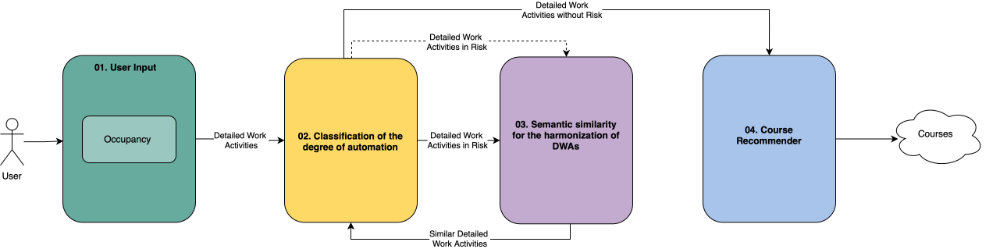

# AI4LABOUR Portal

## Overview

The **AI4LABOUR Portal** is a European project that aims to predict which job positions are likely to be replaced by machines in the future. Additionally, it seeks to ensure that individuals in these positions are retrained or reassigned to roles where their capabilities can be maximized. The portal provides a course recommendation system that helps workers transition from at-risk occupations to safer roles through personalized training recommendations.

## Project Goals

1. **Risk Assessment**: Classify Detailed Work Activities (DWAs) based on their automation risk level
2. **Career Transition Support**: Identify similar, safer work activities for at-risk occupations
3. **Course Recommendation**: Provide personalized course recommendations from Coursera based on required skills for safe work activities
4. **Data-Driven Insights**: Leverage O*NET database and semantic similarity algorithms to make informed recommendations

## Architecture

### System Diagram



### Main Components

#### 1. **Web Application (Streamlit Portal)**
- **Files**: `portalapp.py`, `portalapp2.py`
- **Technology**: Streamlit, Pandas
- **Purpose**: Interactive web interface for course recommendations by occupation

#### 2. **Data Processing Pipeline**
- **O*NET Data Extraction**: SQL queries to extract datasets from the O*NET relational database
- **Risk Classification**: Machine learning models to classify DWAs into risk categories
- **Similarity Calculation**: Semantic similarity algorithms to find similar, safer DWAs
- **Course Matching**: Mapping from skills to Coursera courses

#### 3. **Similarity Algorithms**
Multiple versions of similarity calculation notebooks (`similarity_v2.ipynb` through `similarity_v7_dwa.ipynb`, `similarity_v7_coursera.ipynb`) implementing:
- Cosine similarity using embeddings
- BM25 text matching
- Mutual Nearest Neighbors (MNN)
- Hybrid scoring with length penalties and stopword filtering
- Z-score normalization
- Maximum Marginal Relevance (MMR) for diversity

## Workflow

### Step 1: User Input
1. User selects their occupation from a dropdown menu
2. System retrieves associated Detailed Work Activities (DWAs) from `filtrado8_results.csv`
   - Maps occupation → DWAs

### Step 2: Risk Classification
Two approaches available:

**Option A: Classification Algorithm**
- Uses `filtrado18_results.csv` dataset
- Removes `dwa_id` and `avg_degree_of_automation` columns to create feature set
- Applies trained classification model to assign labels:
  - `risk`: High automation risk
  - `no risk`: Low automation risk
- Filters DWAs with `risk` label

**Option B: Quartile-based Dataset**
- Uses `filtrado18_results_risk.csv` (or `filtrado18_results_degree_cat.csv`)
- Directly selects DWAs with `risk` label from pre-classified dataset

### Step 3: Semantic Similarity
1. For each at-risk DWA, find similar DWAs using `dwa_top3.csv`
2. Check risk level of similar DWAs:
   - If similar DWA is `no risk` → use it for course mapping
   - If still `risk` → check next similar DWA (up to top-3)
   - If all similar DWAs are at risk → mark as 100% automation risk
3. Output: Safe DWAs (or neutral) with their source at-risk DWA

### Step 4: Course Recommender
1. Map safe DWAs to skills using `dwa_skill_top3.csv`
2. Match skills to Coursera courses from `courses_full.csv` (or `courses.json`)
3. Display recommended courses with:
   - Course name, URL, language, topics
   - Number of matched skills
   - Skills coverage

## Data Sources

### O*NET Database
- **Location**: `eerr/` directory
- **Format**: SQL database and text exports
- **Content**: Occupational information, work activities, skills, tasks
- **Extraction Scripts**: 
  - `eerr/filtrado8/`: Occupation-level filtering
  - `eerr/filtrado18/`: DWA-level filtering with degree of automation
  - `eerr/filtrado18_degree_of_automation/`: Enhanced automation metrics

### Coursera Courses
- **Location**: `data/courses_full.csv`, `coursera/courses.json`
- **Content**: Course metadata including skills, topics, languages, URLs
- **Download Script**: `descargar_coursera.py`

### Key Datasets

| Dataset | Description |
|---------|-------------|
| `filtrado8_results.csv` | Occupation to DWA mapping |
| `filtrado18_results_degree_cat.csv` | DWA risk classification (Bajo/Alto) |
| `dwa_top3.csv` | Top-3 similar DWAs for each DWA |
| `dwa_skill_top3.csv` | Top-3 skills for each DWA |
| `courses_full.csv` | Coursera courses with skills mapping |

## Project Structure

```
ai4labour_portal_oeg2/
├── portalapp.py              # Main Streamlit application (v1)
├── portalapp2.py             # Enhanced Streamlit application (v2)
├── descargar.py              # Script to download/zip results
├── descargar_coursera.py     # Script to download Coursera data
│
├── data/                     # Main data directory
│   ├── filtrado8_results.csv
│   ├── filtrado18_results_degree_cat.csv
│   ├── dwa_top3.csv
│   ├── dwa_skill_top3.csv
│   ├── courses_full.csv
│   └── ... (other datasets)
│
├── eerr/                     # O*NET data extraction
│   ├── filtrado8/            # Occupation-level queries
│   ├── filtrado18/           # DWA-level queries
│   ├── filtrado18_degree_of_automation/
│   └── *.ipynb               # Preprocessing notebooks
│
├── similarity_v*.ipynb      # Similarity calculation notebooks
├── gold_*.ipynb              # Gold standard evaluation notebooks
├── inspect*.ipynb            # Data inspection notebooks
│
├── coursera/                 # Coursera data processing
│   ├── coursera.ipynb
│   └── courses.json
│
├── results_dwa*/             # DWA similarity results
├── results_coursera*/        # Coursera matching results
│
├── analisis/                 # Analysis outputs
│   ├── inventory/
│   ├── key_tables/
│   └── plots_inspection/
│
└── tables/                   # LaTeX tables for reports
```

## Key Features

### Risk Assessment
- **Automation Risk Classification**: Categorizes DWAs as "Bajo" (Low risk) or "Alto" (High risk)
- **Quartile-based Analysis**: Uses degree of automation quartiles for risk assessment
- **Multiple Classification Methods**: Supports both ML-based and rule-based classification

### Semantic Similarity
- **Embedding-based Similarity**: Uses sentence transformers for semantic matching
- **Hybrid Scoring**: Combines cosine similarity, BM25, and other signals
- **Top-K Retrieval**: Finds top-3 most similar DWAs for each at-risk DWA
- **Mutual Nearest Neighbors**: Ensures reciprocal similarity relationships

### Course Recommendation
- **Skill-based Matching**: Maps DWAs → Skills → Courses
- **Multi-language Support**: Filters courses by language
- **Coverage Metrics**: Shows how many target skills each course covers
- **Export Functionality**: Download results as CSV

### Explainability
- **Route Tracking**: Shows conversion paths (SAFE_DIRECT, SAFE_VIA_NEIGHBOR, FALLBACK_RISKY)
- **Step-by-step Visualization**: Displays DWA risk levels, neighbors, and skill mappings
- **Transparency Metrics**: Provides detailed metrics for each step of the pipeline

## Usage

### Running the Web Application

1. **Install Dependencies**:
   ```bash
   pip install streamlit pandas
   ```

2. **Run the Portal**:
   ```bash
   streamlit run portalapp2.py
   ```

3. **Access the Interface**:
   - Open browser to `http://localhost:8501`
   - Select an occupation from the dropdown
   - View recommended courses and conversion paths

### Configuration Options

- **Data Directory**: Specify path to data folder (default: `data/`)
- **Fallback Mode**: Allow risky DWAs if no safe neighbors found
- **Max Courses**: Limit number of courses displayed (10-500)
- **Language Filter**: Filter courses by language

## Technical Details

### Similarity Calculation Pipeline

1. **Text Embedding**: Convert DWAs to embeddings using sentence transformers
2. **Cosine Similarity**: Compute pairwise cosine similarity matrix
3. **Normalization**: Apply L2 normalization and z-score normalization
4. **Filtering**: Apply thresholds (z-score, MNN, score-based)
5. **Re-ranking**: Use hybrid scoring with BM25, length penalties, stopword filtering
6. **Diversity**: Apply MMR for result diversification
7. **Top-K Selection**: Return top-3 most similar DWAs

### Risk Classification

- **Feature Engineering**: Extracts features from O*NET database
- **Model Training**: Trains classification models on labeled data
- **Quartile Analysis**: Uses automation degree quartiles for risk categorization
- **Static Dataset**: Pre-computed risk labels in `filtrado18_results_degree_cat.csv`

### Data Processing

- **SQL Queries**: Extracts structured data from O*NET database
- **CSV Generation**: Converts query results to CSV format
- **Normalization**: Normalizes DWA titles and skills for matching
- **Aggregation**: Groups courses by URL, name, language, topics

## Results and Analysis

### Output Directories

- **`results_dwa*/`**: Similarity results for DWA matching
- **`results_coursera*/`**: Course matching results
- **`analisis/`**: Analysis outputs, plots, and inspection data
- **`tables/`**: LaTeX tables for documentation

### Evaluation

- **Gold Standard**: Evaluation datasets in `data/gold*.json` and `data/gold*.csv`
- **Notebooks**: `gold_coursera.ipynb`, `gold_dwa.ipynb` for evaluation
- **Metrics**: Similarity scores, coverage metrics, classification accuracy

## Dependencies

### Core Libraries
- `streamlit>=1.28`: Web application framework
- `pandas`: Data manipulation and analysis
- `numpy`: Numerical computations
- `torch`: Deep learning (for embeddings)

### Optional Libraries
- Sentence transformers: For text embeddings
- BM25 libraries: For text matching
- Jupyter: For notebook execution

## Development

### Notebooks

- **Similarity Development**: `similarity_v2.ipynb` through `similarity_v7_*.ipynb`
- **Data Inspection**: `inspect.ipynb`, `inspect2.ipynb`
- **Preprocessing**: `eerr/*.ipynb` for data extraction and preprocessing
- **Evaluation**: `gold_*.ipynb` for model evaluation

### Data Extraction

The `eerr/` directory contains SQL queries and notebooks for extracting data from O*NET:
- Occupation-level data (`filtrado8/`)
- DWA-level data with automation metrics (`filtrado18/`)
- Enhanced automation analysis (`filtrado18_degree_of_automation/`)

## License

See `LICENSE` file for details.

## Funding

This project has received funding from the European Union’s Horizon2020 research and innovation programme under the Marie Skłodowska-Curie grant agreement No101007961.

## Notes

- The portal currently focuses on English-language courses, though multi-language support is being developed
- Risk classification uses pre-computed quartiles from automation degree analysis
- Similarity calculations use top-3 neighbors without similarity scores in the current version (v2)
- The system provides fallback mechanisms to ensure course recommendations even for high-risk occupations
